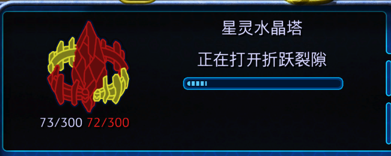

# Rift

# 前言

## 为什么要叫Rift这个名字，而不是别的？
 
中文的话就是： 

## 为什么会有这个项目？
这个问题也等价于：我们既然已经有了形如CMake, Cargo, Gradle, Maven, Make, Bazel等构建系统，为什么我们还要自己做一个？ 
嗯。。。如果你真的用过我上述说的这些构建系统，你就会发现这些构建系统各有各的问题。 
- CMake自不必说，用过的都知道我在说什么；
- Cargo设计不错，但很可惜Rust Only。
- Gradle, Maven这两个其实也不错，但这两兄弟是JVM阵营的，尤其gradle现在开始推.kts，那就更加捆绑IDEA了。（VSCode可没有针对kotlin的官方支持）
- Make是Unix Only，Win想用你得装个Msys/Mingw/Cygwin，你确定你随时随地都能装？
- Bazel只要用过的都知道有多难用。。。

综上所述，思考上面构建系统的长处短处，针对自己需要的东西，自己设计一个构建系统咯。

# 项目说明

### 针对Windows的特殊处理
由于我们使用V8，而rusty_v8有一个操作是创建符号链接，而创建符号链接需要管理员权限。

该行为发生在构建期间，即`cargo check`, `cargo build [--release]`。

注意：该行为会发生在第一次构建时，所以在你第一次打开本项目时，请务必确保必须是管理员模式打开！

除非你执行`cargo clean`或手动删除`target`文件夹，否则你应当是不需要重新执行创建符号链接这一个步骤的。

之后再打开本项目，就不需要管理员模式了。

> 注意：
> - 如果没记错的话，Idea系的IDE在每次启动时都会走一遍全量cargo check，这时候可能会导致你第二次打开时还会出现问题，换句话说你可能每次都得用管理员模式打开本项目（如果你使用idea的话）
> - 至少vscode在执行完第一遍check以后就不再需要管理员模式打开了。

现在的workaround需要等待上游彻底解决这个问题，在此之前只能使用该方案。

参见Issue: https://github.com/denoland/rusty_v8/issues/1563

### 针对网络环境的特殊处理
如果你在网络上有一些问题，为了保证你能顺利编译运行Rift，你还需要做如下额外工作：

> 为了演示方便，这里的基本路径会以我个人用户目录作为示例，即：`C:/Users/user`，如果你想放到其他地方，操作也是一样的。

1. 下载预编译好的v8，参见：https://github.com/denoland/rusty_v8/releases
    > 特别注意：
    > - **一定不能解压缩！**
    > - 必须要按照你目前的操作系统来下载。
2. 建立一个单独的文件夹，我这里取名为`.cache`
    > 现在应该是：`C:/Users/user/.cache`
3. [**建议**] 在`C:/Users/user/.cache`内建立文件夹，我们命名为`rusty_v8`
    > 你不想叫它v8，或者干脆不想新建文件夹，也无妨。
4. 根据你在第一步下载的版本号，建立对应的文件夹
    > 特别注意：
    > - 这一步必须做
    > - 截止到目前（笔者写下该README的时间），rusty_v8的版本号为`v0.102.0`，但其他版本也应当不会有特别大的差别。

    现在它会长这样：`C:/Users/user/rusty_v8/v0.102.0`
5. 将第一步下载好的压缩包放置在第四步建立好的目录中。
    > 它会长这样：`C:/Users/user/.cache/rusty_v8/v0.102.0/rusty_v8_release_x86_64-pc-windows-msvc.lib.gz`

6. 添加环境变量，Key为`RUSTY_V8_MIRROR`，Value为版本号的上级目录，在我们的示例中，为：`C:/Users/user/.cache/rusty_v8`

7. 重启开发环境
